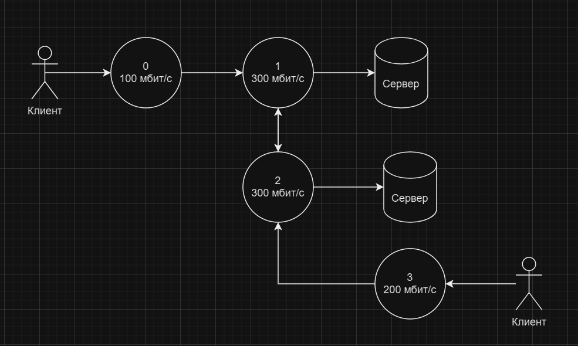

### Введение

Математическая модель и алгоритм позволяют прогнозировать изменения общей нагрузки на сеть при изменении количества
пользователей или объема передаваемых данных. Это дает возможность своевременно принимать решения о необходимости
изменения конфигурации сети или увеличения ее пропускной способности для обеспечения стабильной работы в условиях
повышенной нагрузки.

### Пример входных данных

4 3\
0 1\
1 2\
2 3\
2\
0 2 100\
3 1 200

### Пример выходных данных

0 100\
1 300\
2 300\
3 200

### Иллюстрация примера

